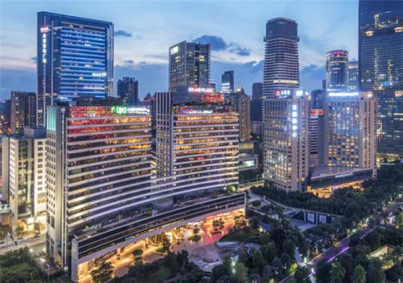
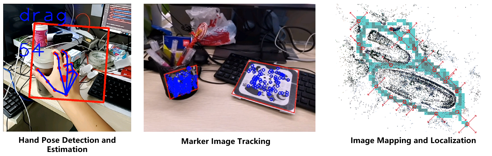
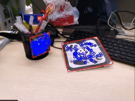
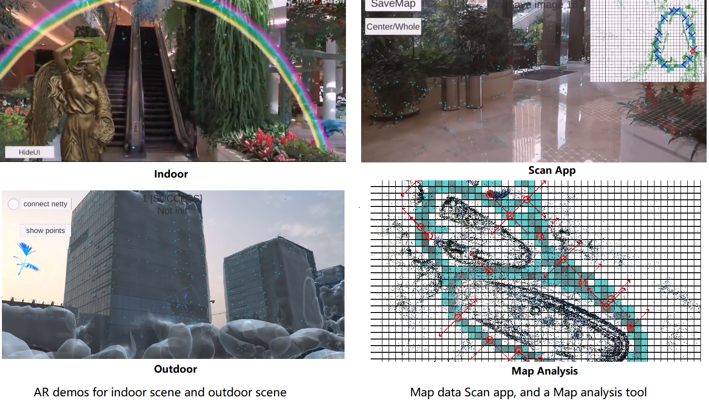
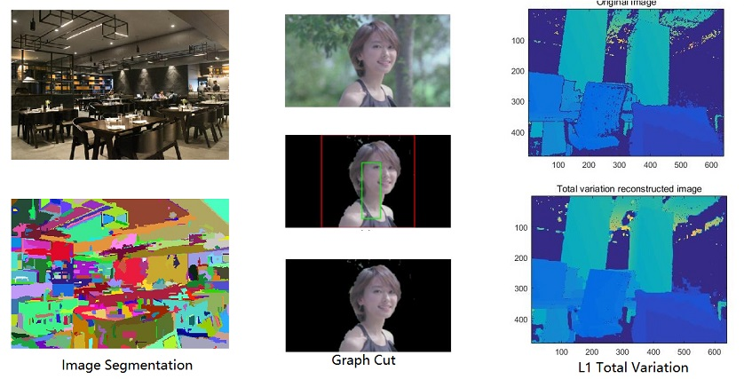

# Company Introduction

* **UTOPA** : also called 'GaoWei Tech' is sub-company fully supported by [GTLAND](http://www.gtlandplaza.com/) . GTLAND is a real estate company. It owns four large plazas in the very center of GuangZhou. However, with the change of the real estate industry, it is in the urge to transform. It chose the 'AR' (augmented reality) industry, to fully explore its plaza

    

* **Team** : we have dozen of algorithm engineers, major in Visual SLAM (simultaneous localization and mapping), Visual Deep Learning, and 3D Reconstruction. Support with a few dozens of employees working on Unity3d, and a few dozens working with server back-end. I am part of the algorithm group.

* **My Work** : I am fully charged with one major aspect (**hand pose detection and estimation algorithm**), and in the direction of two other parts (**single image-based visual localization algorithm**, and **image retrieval and recognition algorithm**). The 'productions' of our group are SDKs that could be used in Unity Android.

    

# Summary and Backups

The three directions of my work. (updated 2020/08)

## Hand Pose Detection and Estimation
We use the ResNet Pose Estimation and YOLOv3 base to develop a Hand Pose Detection and Estimation system, my job is to modify the code of YOLOv3 and ResNet Pose Estimation to suit our project better. 
* We detect hand first(YOLOv3 part), and crop the hand region to estimate hand pose(ResNet Pose Estimation part).
* To have a faster performance at a mobile device, we use MobileNet to exchange the original backbone of YOLOv3, cut off some branch of YOLOv3 head part which has little influence on detection accuracy.
* A system to offer a result with higher frequency, which is realized using tracking. That means we only run detection and estimation when we lose track.
* Encapsulate our algorithm as an SDK and deploy it to Unity Android.

    

**Work Flow**:

* Linux PC algorithm developments.
* Android Native Java environment development, and test the algorithms.
* Build Android Library, build corresponding Unity project.
* Test and find problems.

## Marker image based tracking
We use ORB feature match-based algorithm to do this job.
* Single marker detection: we could realize a faster and more robust detection (using a Branch-and-Bound optimization structure).
* Multi-marker tracking: based on optical flow tracking and a NCC patch match to refine.
* Structured markers detection and tracking ('structured' means we have prior of the relative poses of the markers).
* Randomly placed marker tracking system.
  * Place the markers randomly at the scene.
  * Using an offline reconstruction algorithm to find their relative poses.
  * Used the localized markers to realize AR camera tracking within the scene.
* Cooperate with a third-party SLAM system. Particularly, our system (and the demo video) is in cooperation with ARCORE (from google), and we realize a basic demo that has the potential to achieve Vuforia's performance.

    

**Work Flow**:

* Same as the former one.

## Single image based large scene localization
Our system is based on the Colmap SFM system, but I have our own modification to make it work for our system. 

    

* We have built a system to allow us to use a third-party lidar device to help optimize our map.
* We use a deep learning-based feature detection algorithm to deal with the illumination changing(NetVLAD).
* We are working with deep learning-based MVS methods. 
* We have further developed a local version of the algorithm (which could run entirely in mobile phones, will with a small loss of robustness). 

    

**Work Flow**:

* Linux algorithm development.
* Build serve, and define interface.
* Build Android server communication system, and the message encoder/decoder.
* Build the corresponding Unity project.

## Other Computer Vision stuff

Backups and Documents:

* [Face Landmark Python]Using a custom but fairly straightforward residual neural network architecture for inferring an approximate mesh representation of a human face from a single camera.

    

* [Probability Graph model-based image segmentation]Use Probability Graph model-based algorithm for a simple image segmentation task, a realization of GraphCut algorithm, and an example of L1 heuristic for filling missing data.

    

* [Point Net ++ Kitti Detection Test]Using point cloud clustering algorithm for object detection, and using a Point Net++ network for object classification.

    

